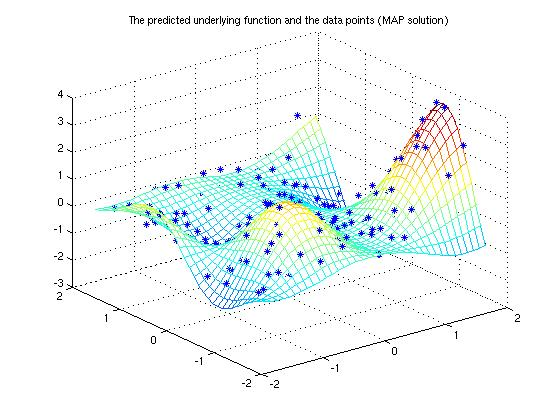

# Regression(회귀문제)

* 회귀란 유전학에서 기원이 된 개념이다.  
* 골턴이란 유전학자가 부모의 키와 아이들의 키 사이의 연관관계를 연구한다  

* 회귀분석은 독립변수의 개수에 따라 두 부류로 나뉜다. 
    * 단순회귀분석: 하나의 종속변수와 하나의 독립변수 사이의 관계를 분석
    * 다중회귀분석: 하나의 종속변수와 여러 독립변수 사이의 관계를 분석

 

* 회귀분석은 가설함수(hypothesis)을 이용한다. 
* 가설함수란 회귀분석시 예측에 사용되는 예측모델을 의미한다. ex)선형회귀->H(x)=Wx+b, loss = H(x)-y
* 회귀분석은 가설함수의 종류에 따라 여러가지로 나뉜다.
    * Linear regression (선형회귀)
    * Logistic regression (로지스틱 회귀)
    * Softmax regression (소프트맥스 회귀)

 

 
<a href="https://ko.wikipedia.org/wiki/%ED%9A%8C%EA%B7%80_%EB%B6%84%EC%84%9D">
figure1. 단순회귀분석
</a>
   

 
<a href="https://research.ics.aalto.fi/pml/software/gpstuff/demo_regression1.shtml">
figure2. 다중회귀분석
</a>
   